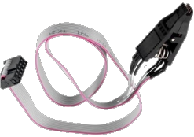

# ATTiny85Core
Absolute minimalistic t85 core with serial i/o but no USB nor bootloader, based on picoCore, together with picoUART.
For easier testing and using I prepare a .json-File for the Arduino IDE integration.

## Why no USB?

Well, I like the idea of Micronucleus bootloader over USB, but on a 8pin-Chip, with 2 pins for VCC an GND there are only 6 GPIOs free for universal use, if you cut the possibility of doing RESET by lowering the pin or ISP programming.
So in reality, there are 5 GPIOs only. Hardwireing two of them to USB (Resistors, Pull-Up and Clamping-Diodes) when you don't have a serial port (CDC) and no easy debugging on Linux is no development base for me. I have several Programmer and the newest/nicesed seems to be a cheap Bluepill with "wrong pullup" and integrated Serial converter/port (Hardware = CDC) together with a cheap SOIC-8 clamp like this
 from ebay, and this

it works as ISP, called "FASTUSBasp": https://hackaday.io/project/21189-fastusbasp-programmer-for-avr-with-usb-to-serial by 
[@amitesh-singh](https://github.com/amitesh-singh)
So, no need for (V-)USB-Interface at all.

## Why no bootloader?

I often develop ideas on a cheap Nano clone with ATMega328 and CH340, because it's fast and easy.
But when I design my own PCBs the the bare chip, I try to reduce the size to a t85 or in the newer days t1604.
If you have 16k FLASH, there is no need to cut all comfort and you needn't to use or reserve ISP. But if you have only 8k and 5 pins, you get another view ... 
